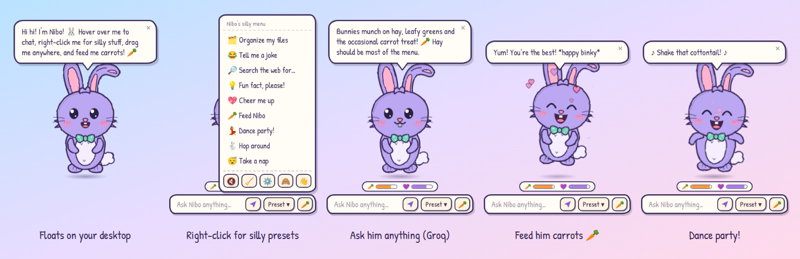
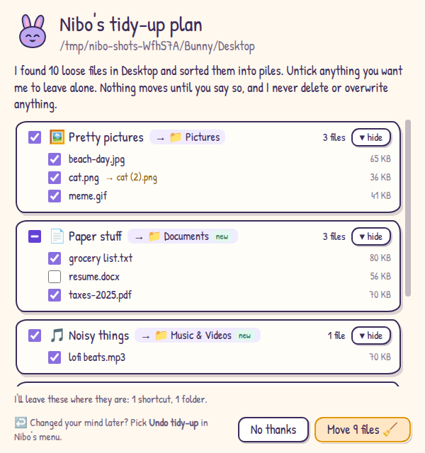

# 🐰 Nibo AI

A cute, hand-drawn AI bunny who floats on your desktop, answers your questions at
[Groq](https://groq.com) speed, tells silly jokes and *really* likes carrots.
Inspired by classic desktop buddies like BonziBuddy.



## Features

- **Floats on your desktop.** Nibo lives in a transparent, always-on-top window and gently bobs up and down.
  Clicks pass straight through the empty space around him, and you can drag him anywhere.
- **Hand-drawn SVG.** Wobbly sketch outlines, pencil hatching, a floppy ear and a little bow tie.
  He blinks, twitches his ears, waves, and his eyes follow your mouse.
- **Ask him anything.** Hover over Nibo and a prompt bar pops up. Answers stream into a speech bubble via the Groq API.
- **Silly presets.** Click **Preset ▾** or right-click Nibo:
  - 🗂️ Organize my files (for real, with your approval, see below)
  - 😂 Tell me a joke
  - 🔎 Search the web for…
  - 💡 Fun fact
  - 💖 Cheer me up
  - 🥕 Feed Nibo
  - 💃 Dance party
  - 🐇 Hop around your screen
  - 😴 Take a nap
  - Plus: squeaky voice on/off, forget the chat, settings, hide and quit.
- **Tidies your files.** Nibo sorts the loose files in your Desktop, Downloads or any folder you pick into
  Pictures, Documents, Music & Videos, Archives & Installers and Code folders, but only after you approve his plan.
- **Feed him.** Hit the 🥕 button and he munches happily, does a binky and floats hearts. Over time he gets hungry:
  a sad face, a rumbling tummy and hints about carrots. Feed him too much and he's stuffed.
- **Squeaky voice (optional).** Nibo can read his replies out loud with your system's text-to-speech.
- **Works offline too.** Without an API key, his little bunny brain still handles greetings, jokes, fun facts,
  math, the time and date, and offers to search the web for everything else.
- **Lives in the tray.** You can hide him, bring him back, and have him start when you log in.

## Download for Windows

1. Go to the [**latest release**](https://github.com/assergames80-prog/Nibo-AI/releases/latest) and download one of
   the two `.exe` files:
   - `Nibo-AI-Setup-x.y.z.exe`: installer with Start-menu and desktop shortcuts.
   - `Nibo-AI-Portable-x.y.z.exe`: a single file you just run, nothing to install.

   Builds of every push are also on the [**Actions** tab](https://github.com/assergames80-prog/Nibo-AI/actions/workflows/build.yml)
   as the **Nibo-AI-Windows** artifact.
2. The executables aren't code-signed yet, so Windows SmartScreen may warn you. Click **More info → Run anyway**.

## Give Nibo a brain (Groq API key)

1. Create a free API key at [console.groq.com/keys](https://console.groq.com/keys).
2. Right-click Nibo → ⚙️ **Settings**, paste the key, press **Test**, then **Save 🥕**.

You can also set a `GROQ_API_KEY` environment variable instead.
The default model is `openai/gpt-oss-20b`, which is fast. You can pick any Groq chat model in Settings,
and if a model is ever retired, Nibo switches to another available one by himself.

## Organize my files

Right-click Nibo → 🗂️ **Organize my files** (or just tell him *"organize my desktop"* or *"tidy up my downloads"*),
then pick **Desktop**, **Downloads** or **Pick a folder…**. Nibo looks around and shows you his plan in a popup:



- **Nothing moves until you click "Move N files".** Untick any file or whole pile you want left alone, or press
  **No thanks** and nothing happens.
- He only moves loose files that sit directly in that folder. Folders, shortcuts, hidden and system files,
  half-finished downloads, files changed in the last two minutes, and file types he doesn't recognize all stay put.
- He never deletes or overwrites anything. If a name is taken, the file gets a number, like `cat (2).png`.
- **Undo:** use the ↩️ chip in his speech bubble or **↩️ Undo tidy-up** in his menu. After you confirm, he puts
  everything back and removes the folders he created, as long as they're empty.
- To stay safe, he refuses system folders. He works in your user folder (Desktop, Downloads, Documents, …) and
  its subfolders.

## How to play

| Do this | Nibo does |
| --- | --- |
| Hover over him | Shows the prompt bar, tummy 🥕 and happiness 💜 meters |
| Type and press Enter | Answers in his speech bubble (Esc cancels) |
| Type `search for …` / `google …` | Opens the search in your browser |
| Click him | Giggles (and wakes up if he's napping) |
| Drag him | Dangles while you carry him, then lands with a squish |
| Right-click him / **Preset ▾** | Opens the silly menu |
| Say "organize my desktop" | Plans a tidy-up and asks for your approval |
| 🥕 button | Carrot time! |
| Tray icon | Show / hide Nibo, feed him, settings, quit |

## Privacy

- What you ask is sent to Groq only when an API key is set. The chat history lives in memory (the last few
  messages) and is wiped by 🧹 *Forget our chat* or by quitting.
- **Organize my files** runs entirely on your computer: file names are never sent to Groq or anywhere else.
  Files only move after you approve the plan, and the last tidy-up is remembered (in `%APPDATA%\Nibo AI\`) so
  you can undo it.
- Your API key is encrypted with the operating system's secure storage (DPAPI on Windows) and kept in Nibo's
  settings file in `%APPDATA%\Nibo AI\`.
- Web searches open in your default browser with Google, DuckDuckGo or Bing (your choice).

## Build from source

You need [Node.js](https://nodejs.org) 20 or newer.

```bash
npm install
npm start               # run Nibo
npm test                # unit tests
npm run dist:win        # Windows installer + portable exe in dist/
npm run dist:portable   # just the portable exe
```

`dist:win` is easiest on Windows. On Linux or macOS the portable exe builds fine, but the NSIS installer step needs Wine.
GitHub Actions builds both on a Windows runner for every push. To publish a release, push a `v*` tag, or run the
**Build Nibo AI** workflow manually with a `release_tag` such as `v1.1.0`.

Other helpers:

- `npm run icons` re-renders `assets/*.png` from `assets/icon.svg`.
- `npm run screenshots` plays a few scenes against a fake Groq server and refreshes the images in `docs/`.

### Project layout

```
src/main/       Electron main process
  main.js       window, tray, dragging, hopping, IPC
  brain.js      Groq chat (streaming, friendly errors, model fallback)
  offline.js    the offline bunny brain, web search URLs, chat intents
  organizer.js  file tidying: plan, apply, undo
  pet.js        tummy & happiness
  store.js      settings + encrypted API key
src/preload/    the small, safe APIs exposed to the pages
src/renderer/   Nibo himself: SVG bunny (index.html), styles, behavior (app.js), speech bubble, settings
assets/         app and tray icons
test/           unit tests and a mock Groq server
```

## Credits

- [Patrick Hand](https://fonts.google.com/specimen/Patrick+Hand) font by Patrick Wagesreiter, SIL Open Font License 1.1
  (`src/renderer/fonts/OFL.txt`).
- Inspired by BonziBuddy and the other desktop pals of the early 2000s.
- Released under the [MIT License](LICENSE).
