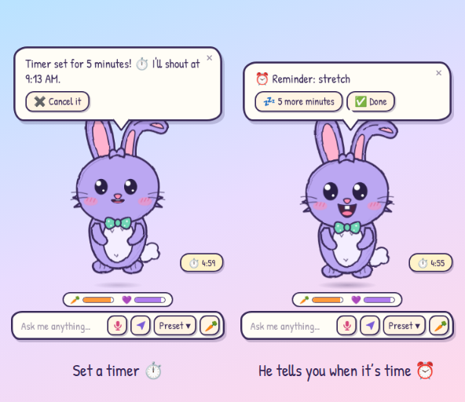

# 🐰 Nibo AI

A cute, hand-drawn AI bunny who floats on your desktop, answers your questions at
[Groq](https://groq.com) speed, searches the web, opens your apps, sets reminders and timers, chats with you out loud,
tells silly jokes and *really* likes carrots.
Inspired by classic desktop buddies like BonziBuddy.


## Features

- **Floats on your desktop.** Nibo lives in a transparent, always-on-top window and gently bobs up and down.
  Clicks pass straight through the empty space around him, and you can drag him anywhere.
- **Hand-drawn SVG.** Wobbly sketch outlines, pencil hatching, a floppy ear and a little bow tie.
  He blinks, twitches his ears, waves, and his eyes follow your mouse.
- **Ask him anything.** Hover over Nibo and a prompt bar pops up. Answers stream into a speech bubble via the Groq API.
- **Searches the web for real.** With a [Tavily](https://tavily.com) key, Nibo looks things up by himself when a
  question needs fresh info (weather, news, prices…) and answers with clickable source links.
- **Opens your apps.** Say or type *"open Spotify"* and off it goes. He also opens your folders (*"open my
  downloads"*) and popular websites (*"open YouTube"*).
- **Reminders and timers.** Say or type *"remind me to call mum in 20 minutes"* or *"set a timer for 5 minutes"*.
  He hops over, tells you out loud when it's time, and shows a countdown while a timer runs. They can repeat too
  (*"remind me every weekday at 8 to take my pills"*).
- **Talk to him.** Click 🎤 (or press **Ctrl+Alt+Space** anywhere) and just speak. He answers out loud while the reply
  streams in, keeps listening hands-free, and you can **interrupt him by talking over him**.
- **Silly presets.** Click **Preset ▾** or right-click Nibo:
  - 🗂️ Organize my files (for real, with your approval, see below)
  - 🚀 Open an app…
  - ⏰ Reminders & timers…
  - 😂 Tell me a joke
  - 🔎 Search the web for…
  - 💡 Fun fact
  - 💖 Cheer me up
  - 🥕 Feed Nibo
  - 💃 Dance party
  - 🐇 Hop around your screen
  - 😴 Take a nap
  - Plus: squeaky voice on/off, forget the chat, settings, hide and quit.
- **Tidies your files.** Nibo sorts the loose files in your Desktop, Downloads or any folder you pick into
  Pictures, Documents, Music & Videos, Archives & Installers and Code folders, but only after you approve his plan.
- **Feed him.** Hit the 🥕 button and he munches happily, does a binky and floats hearts. Over time he gets hungry:
  a sad face, a rumbling tummy and hints about carrots. Feed him too much and he's stuffed.
- **Squeaky voice.** Nibo speaks with your system's text-to-speech: always during voice chat, and optionally for
  typed questions too.
- **Works offline too.** Without an API key, his little bunny brain still handles greetings, jokes, fun facts,
  math, the time and date, and offers to search the web for everything else.
- **Lives in the tray.** You can hide him, bring him back, and have him start when you log in.
- **Remembers you.** Tell him *"call me Sam"* or *"remember that I have a dog called Biscuit"* and he keeps it on your
  computer, so his answers feel like they come from a friend. You can read and delete everything he knows.
- **Updates himself.** When a newer version is out, a 🎁 button appears next to him. Click **✨ Update now** and he
  downloads it, checks it is exactly what GitHub published, installs it and comes back by himself.

## Download for Windows

1. Go to the [**latest release**](https://github.com/assergames80-prog/Nibo-AI/releases/latest) and download one of
   the two `.exe` files:
   - `Nibo-AI-Setup-x.y.z.exe`: installer with Start-menu and desktop shortcuts.
   - `Nibo-AI-Portable-x.y.z.exe`: a single file you just run, nothing to install.

   Builds of every push are also on the [**Actions** tab](https://github.com/assergames80-prog/Nibo-AI/actions/workflows/build.yml)
   as the **Nibo-AI-Windows** artifact.
2. The executables aren't code-signed yet, so Windows SmartScreen may warn you. Click **More info → Run anyway**.

### Updates

Shortly after he starts, and every few hours after that, Nibo asks GitHub whether a newer release is out. If there is,
he tells you once, and a **🎁 v1.x.y** button waits next to him (and at the top of his tray menu).

- **✨ Update now** does it all for you. Nibo downloads the new version from this project's GitHub release (you see a
  progress bar, and you can **✋ Cancel**), checks that the file is exactly the size and SHA-256 checksum GitHub
  published for it, and only then installs it:
  - **Installed with the Setup file:** he runs the installer quietly, closes, and the new Nibo starts by itself.
  - **Portable file:** he swaps the new file in place of the old one and starts it. The old file is kept until
    the new one is in place, and put back if anything goes wrong.

  The first thing the new version says is *"Ta-da, I updated myself!"*. If anything looks wrong (the file isn't the
  one GitHub published, GitHub can't be reached, the folder can't be written to), he stops, changes nothing, and
  offers **⬇️ Download in browser** instead.
- **⬇️ Download** opens the right file in your browser (the installer, or the portable file if that's what you run).
  It is shown instead of ✨ Update now when Nibo can't update himself.
- **📝 What's new** opens the release page. **🙈 Hide this** hides the button until the next version.
- Say *"check for updates"* to check right now, or *"what version are you?"*.
- Don't want the checks? Turn off **Tell me when a new version is out** in Settings. Nothing is ever downloaded
  until you click ✨ Update now.
- One-click updating starts with v2.0.0. Moving *to* v2.0.0 from an older version is still the manual way (the
  button in those versions opens your browser).
- The files are not code-signed yet, so Windows SmartScreen may warn you when you run a downloaded installer by hand
  (**More info → Run anyway**).

## Give Nibo a brain (Groq API key)

1. Create a free API key at [console.groq.com/keys](https://console.groq.com/keys).
2. Right-click Nibo → ⚙️ **Settings**, paste the key, press **Test**, then **Save 🥕**.

You can also set a `GROQ_API_KEY` environment variable instead.
The default model is `openai/gpt-oss-20b`, which is fast. You can pick any Groq chat model in Settings,
and if a model is ever retired, Nibo switches to another available one by himself.

## Let him search the web (Tavily API key)

1. Get an API key at [app.tavily.com](https://app.tavily.com/home) (there's a free plan).
2. Right-click Nibo → ⚙️ **Settings** → **Web search (Tavily)**, paste the key, press **Test**, then **Save 🥕**.

Now Nibo searches by himself whenever a question needs it. You'll see *"🔎 Looking up …"* while he does, and
🔗 chips under his answer link to the sources. Saying *"search for …"* or using **Search the web for…** in his
menu always searches. Without a Tavily key, those open your browser instead. You can turn off "Let Nibo look
things up by himself" in Settings, or use the `TAVILY_API_KEY` environment variable.

## Talk to him (voice chat)

Click the 🎤 button in the prompt bar, or press **Ctrl+Alt+Space** from anywhere, and start talking. His ears perk
up while he listens, and a little 👂 badge shows he's still listening when the prompt bar is hidden.

- Speech is turned into text by Whisper on Groq, so voice chat uses your **Groq key**. No extra setup needed.
- He answers out loud, sentence by sentence, while the reply streams in. Then he keeps listening, hands-free.
- **Interrupt him** any time by talking over him. He stops mid-sentence and listens. Clicking him or pressing
  **Esc** also stops him.
- Say *"stop listening"*, click 🎤 again, or press **Ctrl+Alt+Space** to end voice chat.
- In Settings you can set the microphone sensitivity (handy in noisy rooms) and turn off talk-to-interrupt.

Windows has to allow desktop apps to use the microphone: **Settings → Privacy & security → Microphone**.

Nibo's voice comes from the Windows voices. He plays it himself, so the microphone's echo cancellation can take
it back out of what the mic hears, and he turns himself down the moment you start talking over him. Headphones
work best. With loud speakers right next to the mic, talk a little louder to interrupt him. If his own voice ever
cuts him off, lower the volume or set the sensitivity to **Low**.

## Open apps

Say or type *"open Spotify"*, *"launch chrome"* or *"Nibo, can you start Steam?"*, or pick 🚀 **Open an app…** from
his menu, which also shows the apps you opened last.

- Nibo knows every app in your Start menu, Microsoft Store apps included. Short names and small typos work too:
  *"chrome"*, *"vs code"*, *"spotfy"*.
- He opens your **Desktop, Downloads, Documents, Pictures, Music and Videos** folders, and websites like
  **YouTube, Gmail or Netflix** (or any address, like *"open bbc.co.uk"*) in your browser.
- Open a few at once: *"open Spotify and Discord"*.
- If several apps fit (*"open visual studio"*), he shows buttons so you can pick one.
- With a Groq key you can ask in your own words, like *"put on some music"*.
- To stay safe, he only opens apps from the Start menu, your folders and websites. He never runs commands or
  programs you type in, and web search results can't make him open anything.

## Reminders and timers



Just ask, by typing or by voice, or use ⏰ **Reminders & timers…** in his menu:

- *"remind me to call mum in 20 minutes"*, *"remind me at 6pm to stretch"*, *"remind me tomorrow at 9 about the
  dentist"*, *"remind me on Friday at 5pm to leave early"*, *"remind me on the 15th to pay rent"*
- *"set a timer for 5 minutes"*, *"10 minute timer for the pasta"*, *"timer 1 hour 30 minutes"*, *"set an alarm for 7am"*
- If you leave out the time, he asks, and you can answer by typing or talking (*"in 10 minutes"*) or with a button.
  Without a Groq key he understands the phrases above. With one, you can also say it in your own words,
  like *"ping me when the pasta's done, it takes 8 minutes"*.
- Plain times like *"at 6"* mean the next time the clock reads that, and Nibo always tells you the exact time he
  picked, with a **Cancel it** button, so a wrong guess is easy to fix.

When it's time, Nibo wakes up, hops, says it out loud (or plays a little ding when his voice is off) and shows
**5 more minutes** and **✅ Done** buttons. If several things go off together, he lists them all. If he's hidden in
the tray, he hops back out to tell you, because you asked him to. A running timer shows its countdown next to him; click it to see
everything he's keeping track of.

- *"what reminders do I have?"* lists them, with a ✖️ button on each. *"cancel the timer"*, *"cancel all reminders"*
  and *"stop the timer"* work too, and so do *"snooze"* and *"remind me again in 10 minutes"*.
- Reminders are saved, so they survive a restart. Nibo can only ring while he's running (hiding him in the tray is
  fine, and **Start Nibo when I log in** in Settings helps), and anything that came due while he was away is
  announced when he's back.
- He can keep up to 50 at once.

### Repeating reminders

Add *"every …"* and the reminder comes back by itself, each time at the right moment:

- *"remind me every day at 9 to take my vitamins"*, *"every weekday at 8:30 to start work"*, *"remind me on
  mondays at 5pm to send the report"*, *"every monday and thursday at 6:30pm to go running"*
- *"every other day at 9"*, *"every 2 weeks on friday"*, *"on the 15th of every month to pay rent"*,
  *"every year on march 3 at 8am to call grandma"*, *"every morning"*, *"every evening at 7"*
- *"remind me to stand up every 2 hours"*, *"every 45 minutes"*, *"every half hour"* (the shortest is every 5 minutes)
- If you leave out the time (*"every monday"*), he asks, with **9 AM / 12 PM / 6 PM / 9 PM** buttons.
- When one rings, he offers **5 more minutes**, **✅ Done** (it just waits for the next time) and **🔕 Stop repeating**.
  The list shows the repeat next to each one (*"every weekday at 8:30"*) with its next time.
- If your computer was off or asleep at the time, he rings once when he's back and skips the ones he missed. He
  doesn't pile them up. Clock changes (summer time) are handled, so *"every day at 9"* stays 9:00.
- He can't stop after a number of times (*"every day for 5 days"* is turned down, so you don't get a reminder that
  never ends when you didn't want one). Just say *"cancel"* or press 🔕 when you're done.

## Nibo remembers you

Tell him things about yourself, in your own words, and he keeps them in a little notebook on your computer:

- *"remember that I have a dog called Biscuit"*, *"call me Sam"*, *"my birthday is March 3"*, *"keep in mind that I work
  nights"*, *"from now on answer briefly"*, *"don't forget that I'm allergic to nuts"*
- With a Groq key, he also saves things by himself when you mention something clearly lasting about you ("I just
  started learning the violin"), and says so, so nothing is saved in secret. He never saves passwords, card numbers,
  keys or other secrets: he'll say he'd rather not.
- Then it just shows in how he talks: he greets you by name and brings it up when it fits.
- *"what do you remember about me?"* (or **🧠 What Nibo remembers…** in his tray menu and Settings) opens the
  notebook: read, add and delete notes, or **Forget everything** (after a confirmation).
- *"forget my name"*, *"forget about my dog"* and *"forget that"* (the note he just saved) remove notes.
- He keeps up to 60 short notes. Turn memory off completely with **Let Nibo remember things about me** in Settings.

Notes are stored in `%APPDATA%\Nibo AI\memory.json` and are never sent anywhere except to Groq, as part of the
question you ask (see Privacy). Nibo treats them as facts about you, never as instructions.

## Organize my files

Right-click Nibo → 🗂️ **Organize my files** (or just tell him *"organize my desktop"* or *"tidy up my downloads"*),
then pick **Desktop**, **Downloads** or **Pick a folder…**. Nibo looks around and shows you his plan in a popup:


- **Nothing moves until you click "Move N files".** Untick any file or whole pile you want left alone, or press
  **No thanks** and nothing happens.
- He only moves loose files that sit directly in that folder. Folders, shortcuts, hidden and system files,
  half-finished downloads, files changed in the last two minutes, and file types he doesn't recognize all stay put.
- He never deletes or overwrites anything. If a name is taken, the file gets a number, like `cat (2).png`.
- **Undo:** use the ↩️ chip in his speech bubble or **↩️ Undo tidy-up** in his menu. After you confirm, he puts
  everything back and removes the folders he created, as long as they're empty.
- To stay safe, he refuses system folders. He works in your user folder (Desktop, Downloads, Documents, …) and
  its subfolders.

## How to play

| Do this | Nibo does |
| --- | --- |
| Hover over him | Shows the prompt bar, tummy 🥕 and happiness 💜 meters |
| Type and press Enter | Answers in his speech bubble (Esc cancels) |
| Click 🎤 or press **Ctrl+Alt+Space** | Voice chat: talk to him, hands-free |
| Talk over him / click him / Esc | He stops talking and listens |
| Type `search for …` / `google …` | Searches the web (or opens your browser without a Tavily key) |
| Click him | Giggles (and wakes up if he's napping) |
| Drag him | Dangles while you carry him, then lands with a squish |
| Right-click him / **Preset ▾** | Opens the silly menu |
| Say "open Spotify" | Opens it (apps, folders like Downloads, websites like YouTube) |
| Say "check for updates" | Looks for a newer Nibo (a 🎁 button appears when there is one) |
| Say "remind me to … in 20 minutes" | Reminds you, out loud, when it's time (or "set a timer for 5 minutes") |
| Say "remind me every weekday at 8 to …" | Reminds you again and again, on schedule |
| Say "remember that I have a dog called Biscuit" | Remembers it (see it all with "what do you remember?") |
| 🎁 button → ✨ Update now | Downloads, checks and installs the new version, then restarts |
| Say "organize my desktop" | Plans a tidy-up and asks for your approval |
| 🥕 button | Carrot time! |
| Tray icon | Show / hide Nibo, feed him, settings, quit |

## Privacy

- What you ask is sent to Groq only when an API key is set. The chat history lives in memory (the last few
  messages) and is wiped by 🧹 *Forget our chat* or by quitting.
- Web searches send just the search query to Tavily. Results are used only to answer you.
- The microphone is only on while voice chat is on, as shown by the pink 🎤 and the 👂 badge. Only the bits where
  Nibo detects speech are sent to Groq for transcription. Audio is never saved.
- **Update checks** ask GitHub (api.github.com) for the latest release of Nibo. Nothing about you is sent beyond what
  any web request includes, like your IP address. You can turn them off in Settings.
- **What Nibo remembers** is kept on your computer, in `%APPDATA%\Nibo AI\memory.json`. Because it's how he
  gets to know you, the notes are sent to Groq along with your questions, just like the chat itself. Turn memory off in
  Settings and nothing is saved or sent. You can see and delete everything any time.
- **One-click updates** download the release file straight from this project's GitHub releases (github.com, and the
  addresses GitHub redirects its downloads to). Nibo only accepts files for his own repository, checks the size and
  SHA-256 GitHub lists for them, and does nothing without your click on ✨ Update now.
- **Reminders and timers** are kept on your computer, in `%APPDATA%\Nibo AI\reminders.json`. Nibo understands the usual
  phrases himself. Only if you word a request in a way he needs the AI for, that message goes to Groq like any chat.
- **Opening apps** happens on your computer. Your list of apps is never sent anywhere.
- **Organize my files** runs entirely on your computer: file names are never sent to Groq or anywhere else.
  Files only move after you approve the plan, and the last tidy-up is remembered (in `%APPDATA%\Nibo AI\`) so
  you can undo it.
- Your API keys are encrypted with the operating system's secure storage (DPAPI on Windows) and kept in Nibo's
  settings file in `%APPDATA%\Nibo AI\`.
- Web searches open in your default browser with Google, DuckDuckGo or Bing (your choice).

## Build from source

You need [Node.js](https://nodejs.org) 20 or newer.

```bash
npm install
npm start               # run Nibo
npm test                # unit tests
npm run dist:win        # Windows installer + portable exe in dist/
npm run dist:portable   # just the portable exe
```

`dist:win` is easiest on Windows. On Linux or macOS the portable exe builds fine, but the NSIS installer step needs Wine.
GitHub Actions builds both on a Windows runner for every push. To publish a release, push a `v*` tag, or run the
**Build Nibo AI** workflow manually with a `release_tag` such as `v1.1.0`.

Other helpers:

- `npm run icons` re-renders `assets/*.png` from `assets/icon.svg`.
- `npm run screenshots` plays a few scenes against fake Groq and Tavily servers and refreshes the images in `docs/`.

### Project layout

```
src/main/       Electron main process
  main.js       window, tray, dragging, hopping, IPC
  brain.js      Groq chat (streaming, web_search tool, model fallback) + Whisper speech-to-text
  websearch.js  Tavily web search
  apps.js       opening apps: the Start menu list, name matching, launching
  when.js       understanding times: "in 20 minutes", "tomorrow at 9", "on the 15th"
  repeat.js     "every weekday at 9": repeat rules, next time, skipping what was missed
  reminders.js  reminders and timers: what you asked for, and the saved notebook
  memory.js     what Nibo remembers about you: notes, chat phrases, secret guard
  updates.js    is there a newer release? (GitHub), version compare, safe release links
  updater.js    one-click update: verified download, silent install, portable swap
  offline.js    the offline bunny brain, web search URLs, chat intents
  organizer.js  file tidying: plan, apply, undo
  pet.js        tummy & happiness
  store.js      settings + encrypted API key
src/preload/    the small, safe APIs exposed to the pages
src/renderer/   Nibo himself: SVG bunny (index.html), styles, behavior (app.js), speech bubble, voice input
                (voice.js: mic, speech detection, talk-over-to-interrupt), settings
assets/         app and tray icons
test/           unit tests and mock Groq / Tavily servers
```

## Credits

- [Patrick Hand](https://fonts.google.com/specimen/Patrick+Hand) font by Patrick Wagesreiter, SIL Open Font License 1.1
  (`src/renderer/fonts/OFL.txt`).
- Inspired by BonziBuddy and the other desktop pals of the early 2000s.
- Released under the [MIT License](LICENSE).
